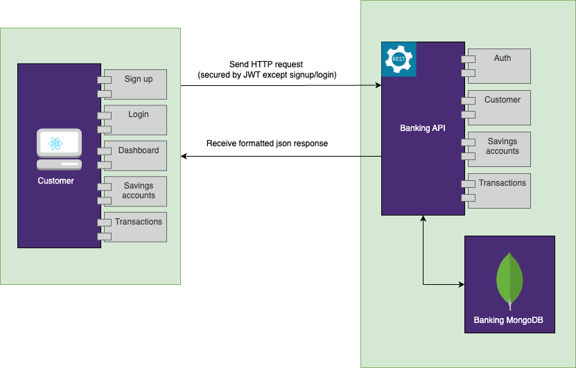

# Techreo Fullstack Challenge

Aplicación que incluye un Backend y un Fronted para gestionar cuentas de ahorro del cliente.

## Descripción general de arquitectura


## Pasos para clonar y ejecutar el proyecto en local

Sigue estos pasos para clonar y ejecutar el proyecto en tu máquina local:

1. Clona el repositorio:
    ```bash
    git clone https://github.com/leonardoalvarez20/techreo-challenge.git
    ```

2. Navega al directorio del proyecto:
    ```bash
    cd techreo-challenge
    ```

3. Instala las dependencias del proyecto Angular:
    ```bash
    cd techreo-challenge-web
    npm install
    ```

4. Instala las dependencias de ASP.NET Core:
    ```bash
    cd ../TechreoChallenge.API
    dotnet restore
    ```

5. Inicia el proyecto Angular:
    ```bash
    cd ../techreo-challenge-web
    ng serve
    ```

6. Inicia el proyecto ASP.NET Core:
    ```bash
    cd ../TechreoChallenge.API
    dotnet run
    ```

7. Abre tu navegador y navega a `http://localhost:4200` para ver el front-end Angular.

## Pasos para ejecutar el proyecto en Docker

Sigue estos pasos para ejecutar el proyecto usando Docker:

1. Clona el repositorio:
    ```bash
    git clone https://github.com/leonardoalvarez20/techreo-challenge.git
    ```

2. Navega al directorio del proyecto:
    ```bash
    cd techreo-challenge
    ```

3. Asegúrate de tener **Docker** y **Docker Compose** instalados en tu máquina. Puedes verificar las versiones instaladas con estos comandos:
    ```bash
    docker --version
    docker-compose --version
    ```

4. Construye las imágenes de Docker utilizando `docker-compose`:
    ```bash
    docker-compose build
    ```

5. Inicia los contenedores:
    ```bash
    docker-compose up
    ```

6. Verifica que los servicios están corriendo:
    - El proyecto Angular estará disponible en `http://localhost:4200`.
    - La API de ASP.NET Core estará disponible en `http://localhost:5000` o el puerto configurado en tu `docker-compose.yml`.

7. Para detener los contenedores:
    ```bash
    docker-compose down
    ```

### Detalles adicionales

- Si modificas el código y deseas reconstruir las imágenes de Docker, puedes usar:
    ```bash
    docker-compose up --build
    ```

- Si solo quieres construir el proyecto de nuevo sin correr los contenedores:
    ```bash
    docker-compose build
    ```